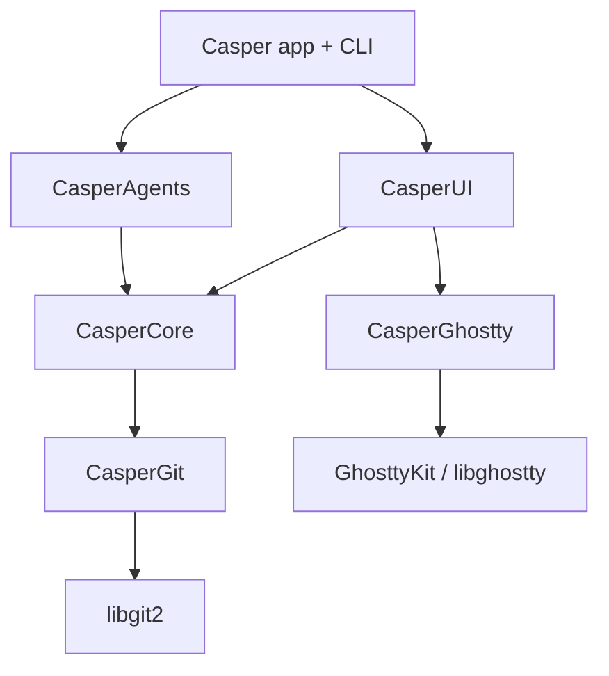

# Casper

[](https://github.com/alexandreroman/casper/actions/workflows/ci.yml)
[](LICENSE)

Casper is a native macOS app that embeds [libghostty][ghostty] to give every
**Git worktree** its own terminal workspace — built for developers running code
agents. It tracks each agent's state and task progress, reserves network ports
per workspace, and bundles a native browser and diff viewer.

> **Status:** under active development and not yet ready for general use. All the
> core layers — the terminal engine, the Git worktree layer, and the agent hook
> pipeline — and the SwiftUI app (Space-grouped sidebar, linked worktrees,
> tmux-style split panes, browser, and diff viewer) are built; live GUI
> verification and polish are ongoing. Claude Code is the first supported agent.

## Features

- **Worktree = workspace** — each workspace maps to a Git worktree; creating one
  opens a plain Ghostty terminal in that worktree (no agent is auto-launched).
- **Agent state & progress** — code-agent hooks feed a per-workspace state
  machine (`idle` / `running` / `waiting` / `done`) and a `completed / total`
  todo progress bar, surfaced in the sidebar with pending-notification dots.
- **Split-pane layout** — tmux-style nested splits (one surface per pane, no
  tabs); each pane is a terminal, a `WKWebView` browser, or a native diff view,
  and a collapsible right-hand inspector offers browser and diff tabs per
  workspace.
- **Per-workspace port reservation** — a contiguous block of 10 ports
  (`CASPER_PORT`) per workspace, so the same app can run once per worktree
  without collisions.
- **Native & lean** — prefers built-in macOS frameworks; only four external
  dependencies (libghostty, swift-argument-parser, libgit2, and HighlightSwift
  for diff syntax highlighting); **arm64-only**.

## Installation

Casper is distributed as a standalone `Casper.app`.

1. Download the latest `Casper.app` archive from the [Releases][releases] page.
2. Unzip it and move `Casper.app` to your `/Applications` folder.
3. Launch it like any other macOS app.

**Requirements:** macOS 15 or later, on Apple Silicon (arm64). On first launch,
Casper wires up its code-agent integration for you — no manual setup.

## Building from source

The rest of this document is for contributors who want to build Casper locally.

### Prerequisites

- **Xcode** (full) — required to build and run the tests; the Command Line Tools
  alone cannot link XCTest. Select it with
  `sudo xcode-select -s /Applications/Xcode.app`.
- **libgit2** and **pkgconf** — `brew install libgit2 pkgconf`. CasperGit links
  libgit2 via pkg-config.
- **vendir** — `brew install vendir`. Carvel's file-vendoring tool, used to sync
  the pinned libghostty reference header (`make vendor`).

The first build downloads the pinned `GhosttyKit.xcframework` (~53 MB) from the
`libghostty-spm` release; subsequent builds reuse the extracted artifact.

### Build & test

```bash
git clone <repo-url> casper
cd casper
make vendor  # sync the pinned libghostty header (once)
make build   # compile
make test    # run the test suite
```

Common tasks are exposed through the `Makefile`:

```bash
make          # debug build (default target)
make help     # list available targets
make dev      # recompile and launch the app (swift run casper)
make build    # debug build
make test     # run the full test suite
make all      # build then test
make release  # size-optimized release build (arm64)
make bundle   # assemble a self-contained Casper.app (release binary + dylibs)
make dist     # package Casper.app into a downloadable .zip + .sha256
make vendor   # re-sync the pinned libghostty header via Carvel vendir
make clean    # remove build artifacts
```

`make bundle`/`make dist` also need `brew install dylibbundler` to embed the
libgit2 dylib chain so the bundled `Casper.app` runs on a clean Mac.

### Continuous integration

Tests run on every push and pull request via GitHub Actions on `macos-14`
([`.github/workflows/ci.yml`](./.github/workflows/ci.yml)). Tagging a `v*`
release builds and publishes `Casper.app` as a GitHub Release
([`.github/workflows/release.yml`](./.github/workflows/release.yml)).

## Architecture

Casper is a Swift Package split into focused modules so that the unstable
libghostty API, the libgit2 layer, and agent specifics each stay isolated.



| Module          | Description                                                                            |
| --------------- | ------------------------------------------------------------------------------------- |
| `CasperCore`    | Models, session store, port allocator, hook parsing, agent-state reducer (pure Swift) |
| `CasperGit`     | In-house wrapper over libgit2 (worktrees, diff, status)                               |
| `CasperGhostty` | Embeds GhosttyKit; owns terminal surfaces and layout                                  |
| `CasperAgents`  | Code-agent adapter (`~/.claude/settings.json` generation) + hook socket server        |
| `CasperUI`      | SwiftUI sidebar, chrome, diff, and browser views                                      |
| `CasperCLI`     | Internal subcommands, sharing the single app binary (swift-argument-parser)           |

The app and CLI ship as one binary: an empty argv launches the GUI, while the
internal subcommands drive the automatic agent-hook integration.

## License

Casper is licensed under the [Apache License 2.0](./LICENSE).

[ghostty]: https://ghostty.org
[releases]: https://github.com/alexandreroman/casper/releases
