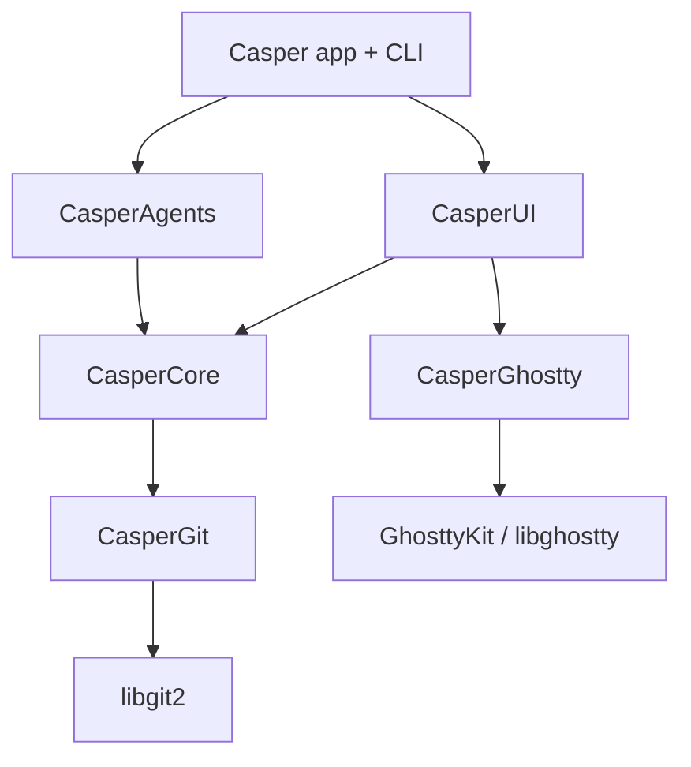

# Casper

Casper is a native macOS app that embeds [libghostty][ghostty] to give every
**Git worktree** its own terminal workspace — built for developers running code
agents (Claude Code first). It tracks each agent's state and task progress,
reserves network ports per workspace, and bundles a native browser and diff
viewer.

> **Status:** early development. Plans 1–3 — `CasperCore`, `CasperGit`, and
> the `CasperAgents`/`CasperCLI` hook pipeline — are implemented and tested;
> the terminal UI and app shell are on the roadmap. See
> [Project status](#project-status).

## Features

- **Worktree = workspace** — each workspace maps to a Git worktree; creating one
  opens a plain Ghostty terminal in that worktree (no agent is auto-launched).
- **Agent state & progress** — Claude Code hooks feed a per-workspace state
  machine (`idle` / `running` / `waiting` / `done`) and a `completed / total`
  todo progress bar, surfaced in the sidebar with pending-notification dots.
- **Free-form layout** — arbitrary nested splits and tab groups; surfaces are
  terminals, a `WKWebView` browser, or a native diff view.
- **Per-workspace port reservation** — a contiguous block of 10 ports
  (`CASPER_PORT`) per workspace, so the same app can run once per worktree
  without collisions.
- **Single binary** — the same executable is both the GUI app and the `casper`
  CLI.
- **Native & lean** — prefers built-in macOS frameworks; only three external
  dependencies (libghostty, swift-argument-parser, libgit2); **arm64-only**.

## Prerequisites

- **macOS 14+**, Apple Silicon (arm64).
- **Xcode** (full) — required to build and run the tests locally; the Command
  Line Tools alone cannot link XCTest. Select it with
  `sudo xcode-select -s /Applications/Xcode.app`.
- **libgit2** (via Homebrew: `brew install libgit2`) — needed from the Git layer
  onward.

## Getting Started

```bash
git clone <repo-url> casper
cd casper
make build   # compile the library and CLI
make test    # run the test suite (89 tests today)
```

## Usage

Common tasks are exposed through the `Makefile`:

```bash
make          # list available targets (default)
make build    # debug build
make test     # run the full test suite
make all      # build then test
make release  # size-optimized release build (arm64)
make clean    # remove build artifacts
```

## Configuration

Casper wires up Claude Code hooks like this: run
`casper hooks setup [<worktree>]` once per worktree to install
`.claude/settings.local.json`, which routes every hook event to
`casper hooks feed` on stdin. Casper then injects the following environment
variables into each terminal surface so `hooks feed` can relay events back to
the app:

| Variable                          | Description                                      |
| --------------------------------- | ------------------------------------------------ |
| `CASPER_PORT`                     | Base of the workspace's reserved 10-port block   |
| `CASPER_SOCKET`                   | Unix socket `casper hooks feed` relays events to |
| `CASPER_WORKSPACE_ID`             | Identifies the workspace emitting hook events    |
| `CASPER_PORT_0` … `CASPER_PORT_9` | Per-port aliases for the whole reserved block    |
| `PATH`                            | Prefixed with the `casper` binary's directory    |

`casper` is **not** installed on your system `PATH`. It is reachable only inside
terminals Casper opens, because Casper prepends its own binary directory to
`PATH` there — so the relative `casper hooks feed` in `settings.local.json`
resolves within Casper's terminals and nowhere else.

## Architecture

Casper is a Swift Package split into focused modules so that the unstable
libghostty API, the libgit2 layer, and agent specifics each stay isolated.



| Module          | Description                                                                            |
| --------------- | ------------------------------------------------------------------------------------- |
| `CasperCore`    | Models, session store, port allocator, hook parsing, agent-state reducer (pure Swift) |
| `CasperGit`     | In-house wrapper over libgit2 (worktrees, diff, status)                               |
| `CasperGhostty` | Embeds GhosttyKit; owns terminal surfaces and layout                                  |
| `CasperAgents`  | Claude Code adapter (`settings.local.json` generation) + hook socket server           |
| `CasperUI`      | SwiftUI sidebar, chrome, diff, and browser views                                      |
| `CasperCLI`     | `casper` subcommands: `hooks setup` / `hooks feed` (swift-argument-parser)            |

The full design and per-milestone plans live in
[`docs/superpowers/`](./docs/superpowers/) — start with the
[design spec](./docs/superpowers/specs/2026-07-01-casper-design.md).

## Project status

| Milestone                          | State                         |
| ---------------------------------- | ----------------------------- |
| **1. CasperCore** (pure core)      | ✅ implemented                 |
| **2. CasperGit** (libgit2)         | ✅ implemented                 |
| **3. CLI + Agents** (socket/hooks) | ✅ implemented, 89 tests green |
| 4. CasperGhostty (embedding)       | planned                       |
| 5. CasperUI + app                  | planned                       |

Tests also run in CI via GitHub Actions on `macos-14`
([`.github/workflows/ci.yml`](./.github/workflows/ci.yml)).

[ghostty]: https://ghostty.org
