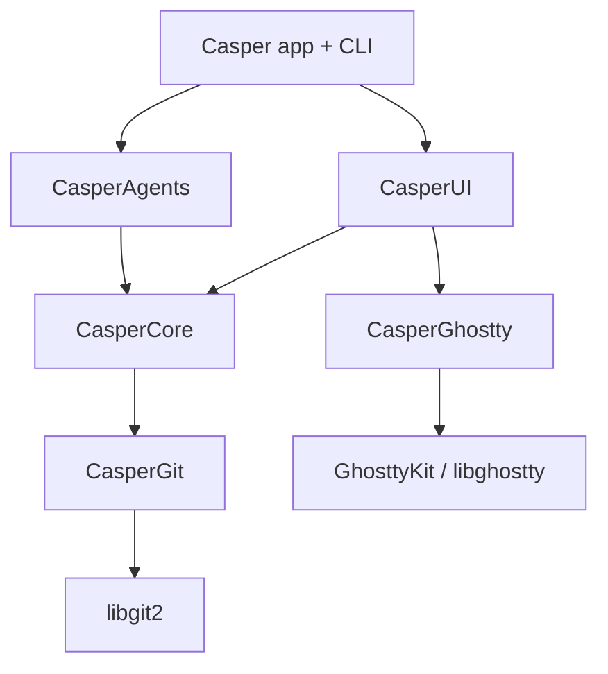

# Casper

[](https://github.com/alexandreroman/casper/actions/workflows/ci.yml)
[](LICENSE)

Casper is a native macOS app that embeds [libghostty][ghostty] to give every
**Git worktree** its own terminal workspace — built for developers running code
agents. It tracks each agent's state and task progress, reserves network ports
per workspace, and bundles a native browser and diff viewer.

> **Status:** under active development and not yet ready for general use. All the
> core layers — the terminal engine, the Git worktree layer, and the `casper`
> control CLI — and the SwiftUI app (Space-grouped sidebar, linked worktrees,
> tmux-style split panes, browser, and diff viewer) are built and have passed a
> live GUI verification pass; polish is ongoing. Claude Code is the first
> supported agent.

## Features

- **Worktree = workspace** — each workspace maps to a Git worktree; creating one
  opens a plain Ghostty terminal in that worktree (no agent is auto-launched).
- **Agent state & progress** — each workspace carries an agent state
  (`working` / `blocked` / `idle` / `done` / `unknown` / `error`) and a
  `completed / total` todo progress bar, surfaced in the sidebar with
  pending-notification dots. State is inferred from terminal output by built-in
  detection (no hooks) and can also be set explicitly via the `casper` CLI
  (see below).
- **Split-pane layout** — tmux-style nested splits (one terminal per pane, no
  tabs); a collapsible right-hand inspector offers a `WKWebView` browser and a
  native diff view per workspace.
- **Per-workspace port reservation** — a contiguous block of 10 ports
  (`CASPER_PORT`) per workspace, so the same app can run once per worktree
  without collisions.
- **Native & lean** — prefers built-in macOS frameworks; only four external
  dependencies (libghostty, swift-argument-parser, libgit2, and HighlightSwift
  for diff syntax highlighting); **arm64-only**.

## Installation

Casper is distributed as a standalone `Casper.app`.

1. Download the latest `Casper.app` archive from the [Releases][releases] page.
2. Unzip it and move `Casper.app` to your `/Applications` folder.
3. Launch it like any other macOS app.

**Requirements:** macOS 15 or later, on Apple Silicon (arm64). On first launch,
Casper wires up its code-agent integration for you — no manual setup.

## Building from source

The rest of this document is for contributors who want to build Casper locally.

### Prerequisites

- **Xcode** (full) — required to build and run the tests; the Command Line Tools
  alone cannot link XCTest. Select it with
  `sudo xcode-select -s /Applications/Xcode.app`.
- **libgit2** and **pkgconf** — `brew install libgit2 pkgconf`. CasperGit links
  libgit2 via pkg-config.
- **vendir** — `brew install vendir`. Carvel's file-vendoring tool, used to sync
  the pinned libghostty reference header (`make vendor`).

The first build downloads the pinned `GhosttyKit.xcframework` (~53 MB) from the
`libghostty-spm` release; subsequent builds reuse the extracted artifact.

### Build & test

```bash
git clone <repo-url> casper
cd casper
make vendor  # sync the pinned libghostty header (once)
make build   # compile
make test    # run the test suite
```

Common tasks are exposed through the `Makefile`:

```bash
make          # debug build (default target)
make help     # list available targets
make dev      # recompile and launch the app (swift run casper)
make build    # debug build
make test     # run the full test suite
make all      # build then test
make release  # size-optimized release build (arm64)
make bundle   # assemble a self-contained Casper.app (release binary + dylibs)
make dist     # package Casper.app into a downloadable .zip + .sha256
make vendor   # re-sync the pinned libghostty header via Carvel vendir
make clean    # remove build artifacts
```

`make bundle`/`make dist` also need `brew install dylibbundler` to embed the
libgit2 dylib chain so the bundled `Casper.app` runs on a clean Mac.

### Continuous integration

Tests run on every push and pull request via GitHub Actions on `macos-14`
([`.github/workflows/ci.yml`](./.github/workflows/ci.yml)). Tagging a `v*`
release builds and publishes `Casper.app` as a GitHub Release
([`.github/workflows/release.yml`](./.github/workflows/release.yml)).

## Architecture

Casper is a Swift Package split into focused modules so that the unstable
libghostty API, the libgit2 layer, and agent specifics each stay isolated.



| Module          | Description                                                                            |
| --------------- | ------------------------------------------------------------------------------------- |
| `CasperCore`    | Models, session store, port allocator, control-channel protocol + socket (pure Swift) |
| `CasperGit`     | In-house wrapper over libgit2 (worktrees, diff, status)                               |
| `CasperGhostty` | Embeds GhosttyKit; owns terminal surfaces and layout                                  |
| `CasperAgents`  | Per-surface environment injection (`CASPER_WORKSPACE_ID`, `CASPER_CONTROL_SOCKET`, `CASPER_SESSION`, …) |
| `CasperUI`      | SwiftUI sidebar, chrome, diff, and browser views                                      |
| `CasperCLI`     | Domain subcommands, sharing the single app binary (swift-argument-parser)             |

The app and CLI ship as one binary: an empty argv launches the GUI, while a
recognized subcommand runs the CLI and exits.

### CLI

`casper` is only reachable from inside a Casper-opened terminal, where the app
prepends its own binary directory to `PATH`. The CLI is organized by domain,
targeting the workspace behind the current terminal by default:

```bash
casper status set running                    # set the agent state
casper progress set --total 5 --current 2 --label "run tests"
casper progress clear
casper notify --message "needs review"       # raise the attention flag + notify
casper terminal new --command "npm test"     # open a terminal (split right)
casper terminal list                         # list the workspace's terminals
casper terminal close <id>                   # close a terminal by id
casper browser open https://example.com      # load a URL in the inspector browser
casper diff open Sources/App/Main.swift      # open the diff, scroll to a file
casper workspace list                        # enumerate workspaces
casper workspace current                     # print the current workspace + path
casper workspace new --branch feature/x      # create a Git worktree workspace
casper workspace delete                      # destroy a workspace (worktree + branch)
```

Every workspace-scoped command accepts `--workspace <id-or-name>` to target a
workspace other than the current one. Commands talk to the running app over a
Unix domain socket named by `$CASPER_CONTROL_SOCKET`, injected per terminal
alongside `$CASPER_WORKSPACE_ID` and `$CASPER_PORT[_0..9]`.

### Named sessions

Launch the app with `casper --session <name>` (name: 1–32 chars from
`[A-Za-z0-9._-]`) to run an **isolated instance**: its layout file
(`session-<name>.json`), control socket, and debug socket are all suffixed with
the session name, and its terminals carry `CASPER_SESSION=<name>`. This lets a
throwaway/test build run alongside your real Casper without clobbering its saved
layout or sockets. With no `--session`, paths are exactly as before.

Every command is machine-readable: on success it prints a JSON object (or array)
to stdout describing the affected `workspace` and any resulting state; on error
it prints `{"error":"…"}` to stderr and exits non-zero. `workspace delete` is
destructive (it removes the worktree folder and its branch) and refuses the
primary workspace.

Casper has no agent-hook integration: an agent reports its state by calling these
commands itself (e.g. `casper status set running`), so the surface is explicit
and agent-agnostic.

## License

Casper is licensed under the [Apache License 2.0](./LICENSE).

[ghostty]: https://ghostty.org
[releases]: https://github.com/alexandreroman/casper/releases
