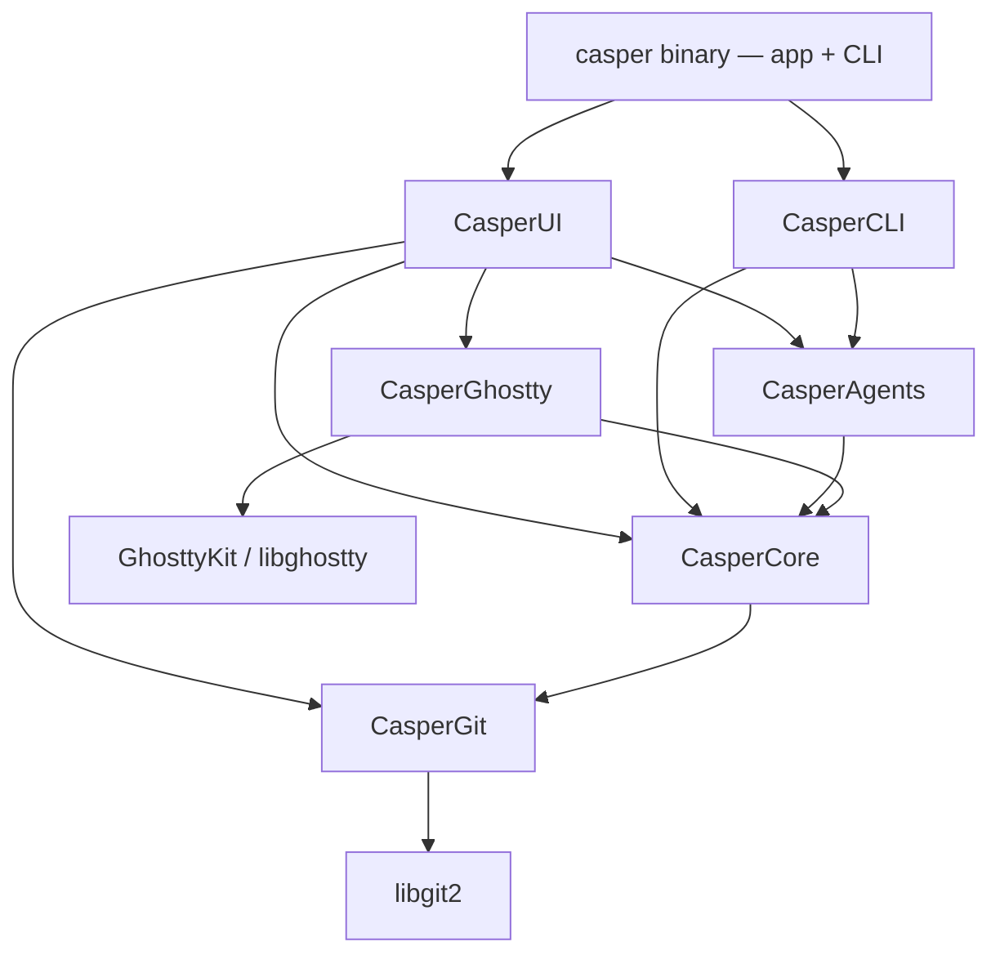

# Casper

[](https://github.com/alexandreroman/casper/actions/workflows/ci.yml)
[](LICENSE)

Casper is a native macOS app that embeds [libghostty][ghostty] to give every
**Git worktree** its own terminal workspace — built for developers running code
agents. It tracks each agent's state and task progress, reserves network ports
per workspace, and bundles a native browser and diff viewer.

## Features

- **Worktree = workspace** — each workspace maps to a Git worktree; creating one
  opens a plain Ghostty terminal in that worktree (no agent is auto-launched).
  ⌘-click a link in the terminal to open it in your browser.
- **Agent state & progress** — each workspace carries an agent state (`working`
  / `blocked` / `idle` / `done` / `unknown` / `error`) and a `completed / total`
  todo progress bar, surfaced in the sidebar with pending-notification dots.
  State is inferred from terminal output by built-in detection (no hooks) and
  can also be set explicitly via the `casper` CLI (see below).
- **Agent integrations** — works with Claude Code, OpenAI Codex CLI, and
  opencode, and launches none of them. Casper detects whether each agent's
  Casper integration is installed and current, and shows a quiet, dismissible
  reminder in the sidebar when one needs attention; it never writes another
  tool's configuration. See [Coding agents](#coding-agents).
- **Split-pane layout** — tmux-style nested splits (one terminal per pane, no
  tabs); a collapsible right-hand inspector offers a `WKWebView` browser and a
  native diff view per workspace. Each terminal remembers the font size you set
  with ⌘+ / ⌘- and restores it on relaunch.
- **Open in Editor** — a title-bar split button opens the workspace's worktree
  in Visual Studio Code, IntelliJ IDEA, or Xcode; each workspace remembers the
  editor it was last opened with.
- **Per-workspace port reservation** — a contiguous block of 10 ports per
  workspace, injected as `CASPER_PORT` in worktree workspaces only, so the same
  app can run once per worktree without collisions. The repository's main
  working tree gets no `CASPER_PORT` and keeps the project's default ports.
- **Native & lean** — prefers built-in macOS frameworks; only five external
  dependencies (libghostty, swift-argument-parser, libgit2, HighlightSwift for
  diff syntax highlighting, and Sparkle for auto-update); **arm64-only**.

## Installation

Casper is distributed as a standalone `Casper.app`.

1. Download the latest `Casper.app` archive from the [Releases][releases] page.
2. Unzip it and move `Casper.app` to your `/Applications` folder.
3. Launch it like any other macOS app.

**Requirements:** macOS 15 or later, on Apple Silicon (arm64). The `casper` CLI
needs no installation: Casper injects it into the `PATH` of every terminal it
opens, so agents and shells running inside a workspace can call it directly.

**Agent integration (strongly recommended):** install
[casper-skills][casper-skills] for the agent you use. Casper works fine without
it, but nothing then reports the agent's state: the sidebar badge, the progress
bar and the notification dot only move if the agent calls the `casper` CLI
itself. With the plugin its own lifecycle does that for you. See
[The integration plugin](#the-integration-plugin) for the per-agent installers.

**Updates:** Casper checks for new releases once a day and offers them through
**Casper ▸ Check for Updates…**; nothing is installed without your say-so. Every
update is verified against a signing key embedded in the app, so a tampered
download is refused.

## Coding agents

Casper supports three coding agents — **Claude Code**, **OpenAI Codex CLI**,
and **opencode**. Everything an agent drives *explicitly* is agent-agnostic: the
`casper` CLI verbs behind agent state, progress, notifications and the info
panel behave identically whichever agent calls them, and the working badge
lights up for any agent that emits the standard OSC 9;4 progress sequence.
Casper never launches an agent for you; you start yours in a Casper terminal
yourself.

Agents talk to Casper through the `casper` CLI (see [CLI](#cli)). You can call
those commands by hand, but the usual route is a small **integration plugin**
installed into the agent, which wires the agent's own lifecycle to them so the
sidebar badge, the progress bar and the notification dot work without you
instrumenting anything. Each agent installs that plugin with its own installer:
**Casper never writes another tool's configuration.** All Casper does is detect
what an installer left behind.

### The integration plugin

That plugin lives in its own repository, [casper-skills][casper-skills], and
covers all three agents from a single source. It wires the agent's own hook or
plugin lifecycle to the `casper` CLI: the sidebar badge follows the turn and
every tool call, the progress bar mirrors the agent's own todo list step by
step, and a blocked agent raises a notification instead of ending its turn
quietly. It also ships a `casper` skill that teaches the agent the rest of the
surface — the info panel, the browser panel, the diff view, extra terminals,
workspaces, and a repository's `.casper.json`. Outside a Casper terminal it
does nothing at all, and it never blocks or fails a turn when Casper isn't
running.

Each agent installs it with its own installer. **Claude Code**, from its TUI:

```text
/plugin marketplace add alexandreroman/casper-skills
/plugin install casper@casper
```

**OpenAI Codex CLI**:

```bash
codex plugin marketplace add alexandreroman/casper-skills
codex plugin add casper@casper
```

**opencode** (drop `-g` to install into the project's config instead):

```bash
opencode plugin github:alexandreroman/casper-skills -g
```

Codex needs one step more: it hashes command hooks it did not install itself, so
this plugin's hooks stay completely inert — installed, current, and doing
nothing — until you review and approve them with `/hooks` in its TUI. An upgrade
that changes a hook sends it back for review, so check `/hooks` after every
update, not only the first install.

## Keyboard shortcuts

| Shortcut  | Action                                         |
| --------- | ---------------------------------------------- |
| `⌘O`      | Add Folder… — open a repository or worktree    |
| `⌘D`      | Split Right                                    |
| `⌘⇧D`     | Split Down                                     |
| `⌘1`–`⌘9` | Switch to the sidebar's 1st–9th workspace      |
| `⌘C`      | Copy the terminal selection                    |
| `⌘V`      | Paste into the terminal                        |
| `⌘A`      | Select all in the terminal                     |
| `⌘+`/`⌘-` | Grow / shrink the focused terminal's font      |

Holding ⌘ for a moment reveals the `⌘1`–`⌘9` number hints in the sidebar.

## Building from source

The rest of this document is for contributors who want to build Casper locally.

### Prerequisites

- **Xcode 26 or later** (full) — required to build at all (the project uses
  Swift 6.2 isolated conformances) and to run the tests; the Command Line Tools
  alone cannot link XCTest. Select it with
  `sudo xcode-select -s /Applications/Xcode.app`.
- **libgit2** and **pkgconf** — `brew install libgit2 pkgconf`. CasperGit links
  libgit2 via pkg-config.

The first build downloads the pinned `GhosttyKit.xcframework` (~53 MB) from the
`libghostty-spm` release; subsequent builds reuse the extracted artifact.

### Build & test

```bash
git clone <repo-url> casper
cd casper
make build   # compile (the first run downloads GhosttyKit.xcframework)
make test    # run the test suite
```

Common tasks are exposed through the `Makefile`:

```bash
make          # debug build (default target)
make help     # list available targets
make dev      # recompile and launch the app under a per-branch dev session
make build    # debug build
make test     # run the full test suite
make all      # build then test
make release  # size-optimized release build (arm64)
make bundle   # assemble a self-contained Casper.app (release binary + dylibs)
make dist     # package Casper.app into a downloadable .zip + .sha256 + dSYM
make vendor   # re-sync the pinned libghostty header via Carvel vendir
make icon     # rebuild AppIcon.icns + AppIconDev.icns from the SVGs (needs resvg)
make clean    # remove build artifacts
```

`make bundle`/`make dist` also need `brew install dylibbundler` to embed the
libgit2 dylib chain so the bundled `Casper.app` runs on a clean Mac.

`make vendor` is a **contributor-only** step, not part of building. It needs
`brew install vendir` and re-syncs `Vendor/ghostty/ghostty.h`, a reference-only
copy of the libghostty header, **out of the already-extracted**
`GhosttyKit.xcframework` — so it can only run *after* a successful build, and it
is only worth running when the GhosttyKit pin moves. Nothing in `Sources/`
compiles against the vendored copy; it exists so the exact C API the code
targets stays readable in-tree.

`make bundle` compiles with `-Osize`, extracts the debug symbols to a
`Casper.dSYM` bundle **next to** `Casper.app`, and strips the shipped
executable. `make dist` publishes that dSYM as its own
`Casper-<version>-arm64.dSYM.zip` archive, so a crash report from a release can
still be symbolicated without shipping the symbols to every user.

### Debug build code signing (optional)

`make build` assembles a minimal `Casper-dev.app` bundle around the debug binary
and signs it with a local **Apple Development** identity whenever one is
available in your keychain. This keeps the Screen Recording permission that the
`debug-casper` skill relies on (for screenshot capture) across rebuilds, instead
of macOS re-prompting after every recompile. The `.app` wrapper is required: a
bare signed executable never registers with macOS's privacy database (TCC) at
all, so only a real bundle can be granted the permission. Without an identity
everything still works — the bundle stays ad-hoc signed and you get the usual
re-prompt-on-rebuild behavior.

To create a free identity once (no paid Developer Program membership needed):

1. Xcode → Settings → Accounts → **+** → Apple ID → sign in with any Apple ID.
2. Select the resulting team → **Manage Certificates…** → **+** → **Apple
   Development**.
3. `make build` picks it up automatically from then on — no configuration
   required.

If `security find-identity -v -p codesigning` still reports 0 identities after
creating the certificate, the Apple WWDR intermediate certificate is likely
missing (`codesign` fails with "unable to build chain to self-signed root").
Download the current intermediate from
<https://www.apple.com/certificateauthority/> (e.g. `AppleWWDRCAG3.cer`) and
install it with
`security add-certificates -k login.keychain-db AppleWWDRCAG3.cer`.

See the plan
[`tcc-screen-recording-needs-a-bundle.md`](./.claude/project-memory/references/tcc-screen-recording-needs-a-bundle.md)
for the full rationale.

### Continuous integration

Tests run on every push to `main` and every pull request via GitHub Actions, on
both `macos-15` (the deployment target's floor) and `macos-26`
([`.github/workflows/ci.yml`](./.github/workflows/ci.yml)) — some AppKit layout
behaviour differs between the two, so a single runner would only ever show it as
a failure on the other machine. Tagging a `v*` release builds and publishes
`Casper.app` as a GitHub Release
([`.github/workflows/release.yml`](./.github/workflows/release.yml)), along with
the Sparkle `appcast.xml` feed the in-app updater reads. The release job signs
the archive with the `SPARKLE_PRIVATE_KEY` repository secret and fails if it is
missing — an unsigned feed would be rejected by every installed copy. See the
note [`sparkle-eddsa-key.md`](./.claude/project-memory/references/sparkle-eddsa-key.md).

## Architecture

Casper is a Swift Package split into focused modules so that the unstable
libghostty API, the libgit2 layer, and agent specifics each stay isolated.



| Module          | Description                                                                                             |
| --------------- | ------------------------------------------------------------------------------------------------------- |
| `CasperCore`    | Models, session store, worktree manager, port allocator, control-channel protocol + socket (pure Swift) |
| `CasperGit`     | In-house wrapper over libgit2 (worktrees, diff, status)                                                 |
| `CasperGhostty` | Embeds GhosttyKit; owns terminal surfaces and layout                                                    |
| `CasperAgents`  | Per-surface environment injection (`CASPER_WORKSPACE_ID`, `CASPER_CONTROL_SOCKET`, …)                   |
| `CasperUI`      | SwiftUI sidebar, chrome, diff, and browser views                                                        |
| `CasperCLI`     | Domain subcommands, sharing the single app binary (swift-argument-parser)                               |

The app and CLI ship as one binary, and the routing keys on the *shape* of the
first argument, not on a list of known verbs: empty argv — or a leading `-…`
flag, which is what macOS injects on launch — starts the GUI, while any leading
non-dash word (plus `-h`, `--help` and `--version`) runs the CLI and exits. An
unrecognized word such as `casper bogus` therefore still enters the CLI, which
then reports it as an unknown subcommand.

### CLI

`casper` is only reachable from inside a Casper-opened terminal, where the app
prepends its own binary directory to `PATH`. The CLI is organized by domain,
targeting the workspace behind the current terminal by default:

```bash
casper status set working                    # set the agent state (working|blocked|idle|done|unknown|error)
casper progress set --total 5 --current 2 --label "run tests"
casper progress clear
casper notify --message "needs review"       # raise the attention flag + notify
casper info set --message "## App ready
- API: <http://localhost:8080>"
casper info set --file docs/endpoints.md     # read the Markdown message from a file
printf '## App ready\n' | casper info set    # or read it from stdin
printf '## App ready\n' | casper info set -  # same, with an explicit '-' marker
casper info clear                            # empty the panel and hide its button
casper terminal new                          # open a terminal (split below)
casper terminal list                         # list the workspace's terminals
casper terminal close <id>                   # close a terminal by id
casper browser open https://example.com      # load a URL in the inspector browser
casper browser close                         # collapse the inspector if the browser is showing
casper diff open Sources/App/Main.swift      # open the diff, scroll to a file
casper diff close                            # collapse the inspector if the diff is showing
casper workspace list                        # enumerate workspaces
casper workspace current                     # print the current workspace + path
casper workspace new feature/x               # create a Git worktree workspace
casper workspace new feature/x --base main --command "claude"
casper workspace delete                      # destroy a workspace (worktree + branch)
casper run [name]                            # run a named .casper.json command in a split (defaults to 'run')
```

`casper workspace new <branch>` takes the branch name as a positional argument;
`--base <ref>` forks from a ref other than the space's base branch, and
`--command <cmd>` seeds the workspace's first terminal with a command to run.
`casper terminal new` takes the same `--command <cmd>` to seed the new split,
plus `--working-dir <path>` to start it somewhere other than the workspace's
worktree.

The browser panel doubles as an automation surface, so a coding agent can drive
and inspect the page it just changed:

```bash
casper browser load https://localhost:8080   # navigate without opening the panel
casper browser screenshot --out out.png      # PNG of the page (--width/--height/--url)
casper browser content                       # dump the page's HTML
casper browser url                           # print the page's current URL
casper browser eval "document.title"         # evaluate JavaScript in the page
casper browser click "button.submit"         # click the first matching element
casper browser type "input[name=q]" casper   # type into the first matching element
casper browser key Enter                     # dispatch a keydown/keyup to the page
casper browser console                       # captured console output + uncaught errors (--level)
casper browser wait ".ready"                 # block until a selector holds (or --js <expr>)
casper browser reload                        # reload the page
casper browser scroll-down                   # also scroll-up / scroll-top / scroll-bottom
```

Every workspace-scoped command accepts `--workspace <id-or-name>` to target a
workspace other than the current one. The one exception is `workspace current`,
which reports the terminal's own workspace from `$CASPER_WORKSPACE_ID` and takes
no target. Commands talk to the running app over a Unix domain socket named by
`$CASPER_CONTROL_SOCKET`, injected per terminal alongside `$CASPER_WORKSPACE_ID`
— and, in worktree workspaces only, `$CASPER_PORT`.

Every command is machine-readable: on success it prints a JSON object (or array)
to stdout describing the affected `workspace` and any resulting state; on error
it prints `{"error":"…"}` to stderr and exits non-zero. Ids are printed in
lowercase, and `--workspace` matches an id in either case. `workspace delete` is
destructive (it removes the worktree folder and its branch) and refuses the
primary workspace.

Casper installs and serves no agent hooks of its own: an agent reports its state
by calling these commands itself (e.g. `casper status set working`), so the
surface is explicit and agent-agnostic. A per-agent integration plugin is only a
convenience on top — it wires the agent's lifecycle to exactly these commands.

The info panel keeps only the latest `casper info set` message and never
persists it across app restarts; it's reached by hovering or clicking the info
button next to the workspace's branch/space title. A message is capped at 256
KB; `--message` and `--file` together are an error; and a bare `casper info set`
at an interactive terminal errors instead of waiting on stdin (pipe, redirect,
or the explicit `-` marker all still work).

Clicking a link in the message opens it in the workspace's own browser panel,
since a published endpoint is almost always local; **Command-clicking** it opens
the same link in the system's default browser instead.

### Per-repository configuration (`.casper.json`)

A repository can drop a `.casper.json` file at its root to tailor how Casper
treats its workspaces. Every key lives under `workspace`:

```json
{
  "workspace": {
    "copyFiles": [".env", ".env.local"],
    "scripts": {
      "setup":    "npm install",
      "teardown": "docker compose down",
      "run":      "npm run dev",
      "test":     "npm test"
    }
  }
}
```

- `copyFiles` — patterns for untracked files seeded from the source worktree
  into a new workspace. It replaces the built-in `.env`/`.env.local` default;
  `[]` copies nothing. An invalid entry fails workspace creation before any Git
  mutation.
- `scripts` — shell commands bound to a workspace, each run in a visible
  terminal split. Two reserved keys are lifecycle hooks, run automatically and
  never invocable by hand:
  - `setup` runs once, when the workspace is created (never on restart). A
    non-zero exit keeps its split open with the output and flags the workspace.
  - `teardown` runs just before the workspace is destroyed (after the merge on
    the close path). Deletion proceeds whatever the outcome, bounded by a 30s
    timeout, so a broken cleanup script never traps you.

  Every other key is a named command, launched on demand from the workspace's
  "Run Script" toolbar button and context menu, or with `casper run <name>`. Its
  split closes automatically when the command succeeds (exit 0); on any non-zero
  exit the split stays open with a live shell so you can read the output and
  re-run.

The file is hand-edited (there is no settings UI) and re-read each time it is
needed.

## License

Casper is licensed under the [Apache License 2.0](./LICENSE).

[ghostty]: https://ghostty.org
[releases]: https://github.com/alexandreroman/casper/releases
[casper-skills]: https://github.com/alexandreroman/casper-skills
